# MSc Coursework

## Lab 0

### Implementation Tasks

1. **Remove the `attention_mask` and `labels` arguments from the `hf_input_names` list and re-run the following cell. Use `mg.draw()` to visualize the graph. Observe any changes in the graph topology and explain why they occur.**

### Answer

- **Missing nodes**:
  - `attention_mask` removal eliminates nodes handling padding token processing.
  - `labels` removal excludes loss-related nodes (e.g., cross-entropy loss).
- **Simplified graph now made**: The graph now relies solely on `input_ids`, typical in inference mode without masking or loss calculation.
- **No `attention_mask`** → Padding token handling is disabled, affecting model attention.
- **No `labels`** → Loss calculation is omitted, switching the model to inference mode.

#### Nodes Removed

1. **`attention_mask`**
   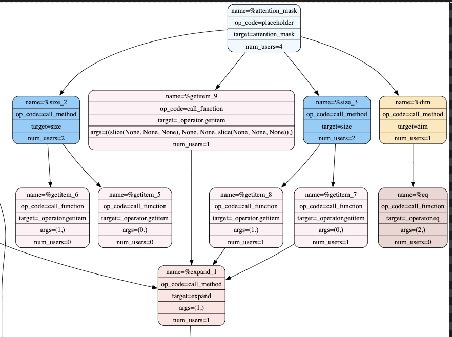
2. **`labels` Before Removal**
   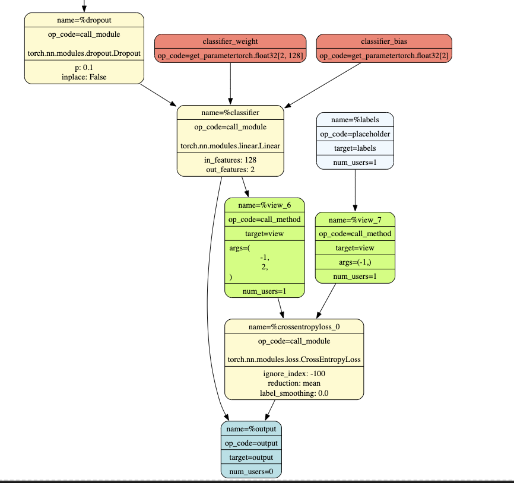
3. **`labels` After Removal**
   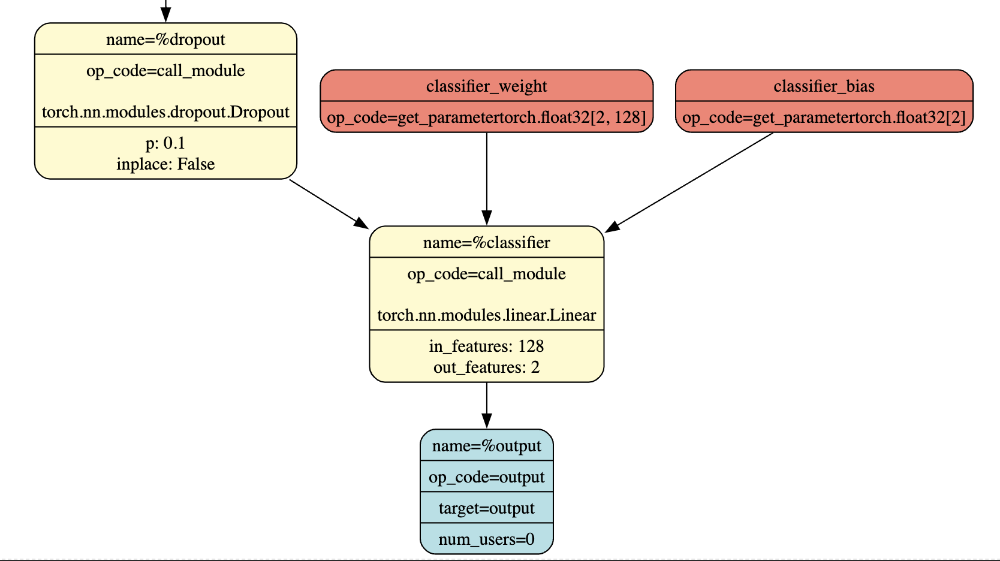

---

## Lab 1

### Implementation Tasks

1. **In Tutorial 3, you quantized every Linear layer in the model to the provided configuration. Now, explore a range of fixed point widths from 4 to 32.**

   a. **Plot a figure where the x-axis is the fixed point width and the y-axis is the highest achieved accuracy on the IMDb dataset, following the procedure in Tutorial 3.**

   **Answer**

   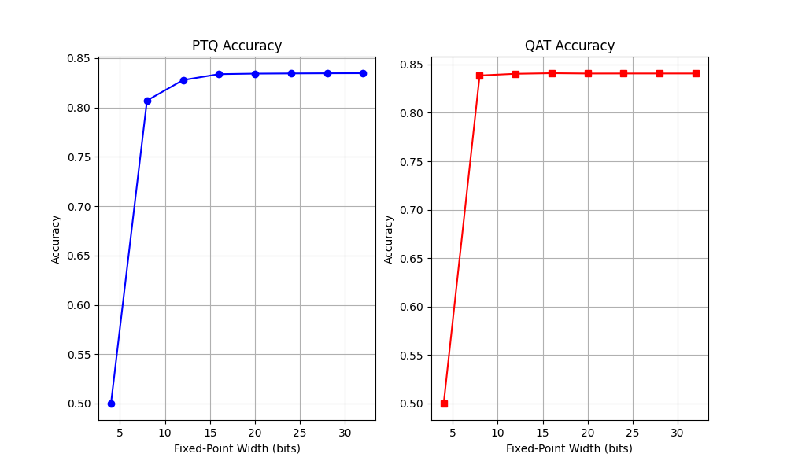

   As the fixed point width increases, the quantization becomes less aggressive preserving more numerical precision, and typically results in higher accuracy. However, wider widths also imply higher computational cost. The figure therefore captures the trade off between precision and efficiency.

   b. **Plot separate curves for PTQ and QAT at each precision to show the effect of post-quantization fine-tuning.**

   **Answer:**

   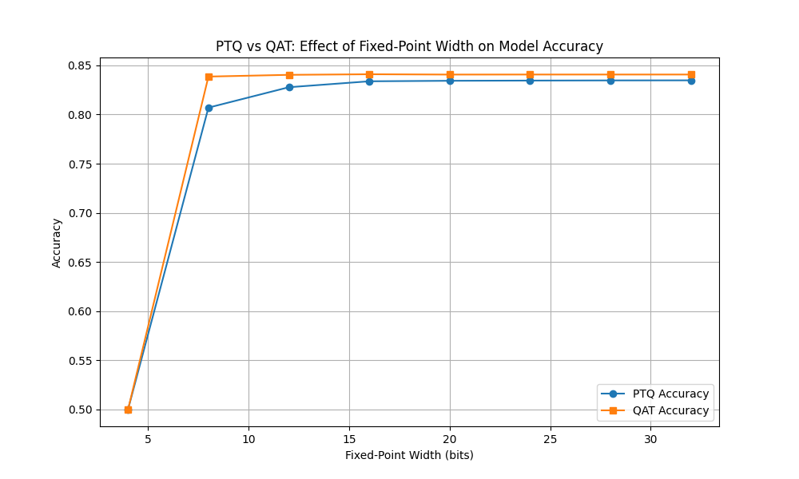

   QAT applies quantization during training, while PTQ quantizes after training is complete. Comparing PTQ and QAT shows that fine-tuning in QAT recovers lost accuracy, especially at lower precisions where quantization errors are more significant.
2. **Take your best obtained model from Task 1 and rerun the pruning procedure, this time varying the sparsity from 0.1 to 0.9.**

   a. **Plot a figure where the x-axis is the sparsity and the y-axis is the highest achieved accuracy on the IMDb dataset, following the procedure in Tutorial 4.**

   b. **Plot separate curves for `Random` and `L1-Norm` methods to evaluate the effect of different pruning strategies.**

   **Answer:**

   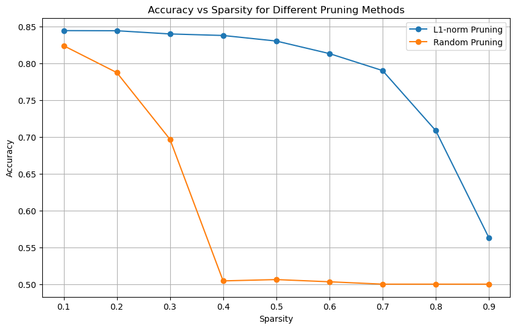

   Random pruning removes weights arbitrarily, while L1-norm pruning removes low-magnitude weights first. L1-norm pruning achieved better accuracy by preserving more important weights.

---

## Lab 2

### Implementation Tasks

1. **Tutorial 5 shows how to use random search to find the optimal configuration of hyperparameters and layer choices for the BERT model.**

   a. **Now, explore using the GridSampler and TPESampler in Optuna.**

   GridSampler exhaustively evaluates combinations of hyperparameters across a grid.
   TPESampler builds a probabilistic model to focus on promising regions, this adaptive strategy allows TPE to achieve better results faster.
   Random is random

   b. **Plot a figure that has the number of trials on the x-axis, and the maximum achieved accuracy up to that point on the y-axis. Plot one curve for each sampler to compare their performance.**

   Observation: TPE achieves better results faster due to its adaptive sampling strategy.

   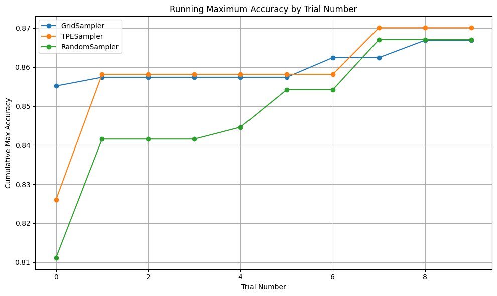
   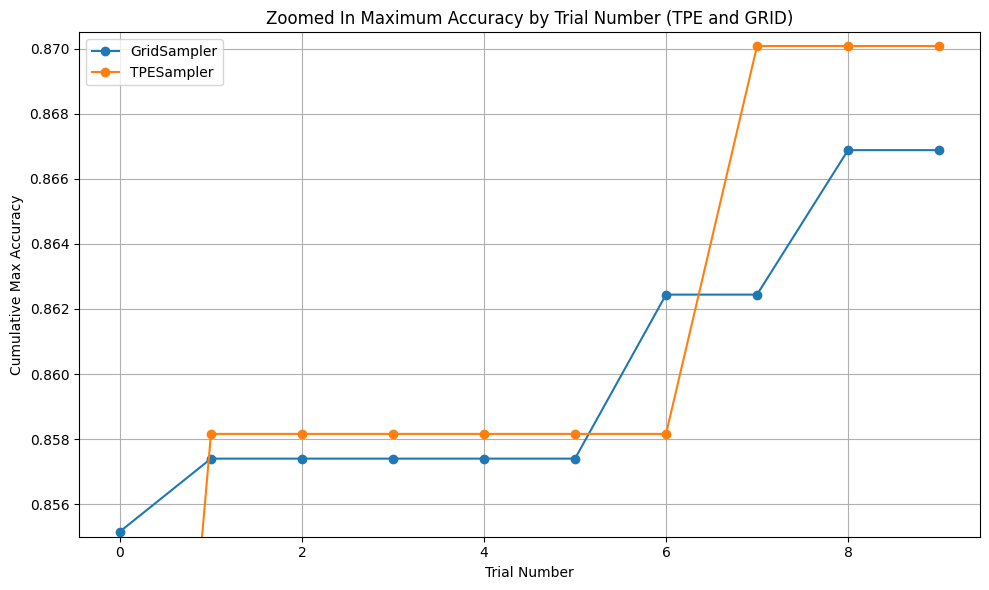

   In my tests, I trained each model for 2 because beyond 2 epochs that the models start to overfit. To evaluate the impact of running for more epochs, I conducted additional experiments on the best-performing model identified by the TPE searcher. The results indicate that increasing the number of epochs beyond 2 leads to overfitting, causing a decline in accuracy. Therefore, for the remaining experiments, we use this as the baseline accuracy and set the number of epochs accordingly when doing PTQ and QAT.

   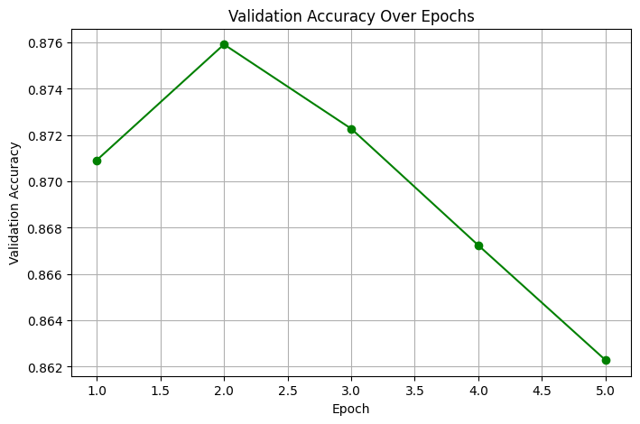
   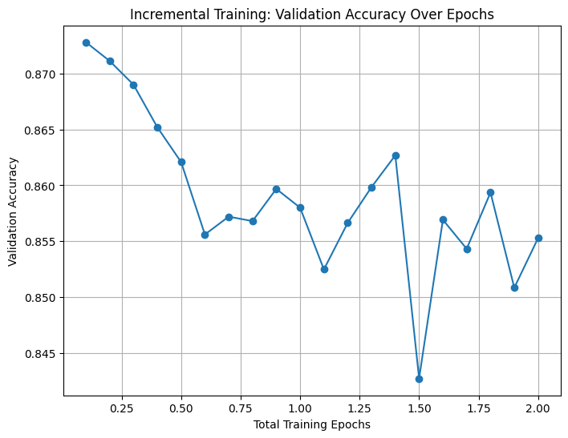
   
3. **In Tutorial 5, NAS is used to find an optimal configuration of hyperparameters, then we use the CompressionPipeline in Mase to quantize and prune the model after search is finished. However, the final compressed model may not be optimal, since different model architectures may have different sensitivities to quantization and pruning. Ideally, we want to run a compression-aware search flow, where the quantization and pruning is considered in each trial.**

   a. **In the objective function, after the model is constructed and trained for some iterations, call the CompressionPipeline to quantize and prune the model, then continue training for a few more epochs. Use the sampler that yielded the best results in Task 1 to run the compression-aware search. The objective function should return the final accuracy of the model after compression. Consider also the case where final training is performed after quantization/pruning.**

   b. **Plot a new figure that has the number of trials on the x-axis, and the maximum achieved accuracy up to that point on the y-axis. There should be three curves:**

   - **The best performance from Task 1 (without compression)**
   - **Compression-aware search without post-compression training**
   - **Compression-aware search with post-compression training**

     **Answer:**
     TPE Search was used as it reusulted in the best accuracy in Task 1.

     Compression-aware NAS with post-training achieves the highest accuracy and stability. Compression-aware NAS without post-training suffers from initial low accuracy and does not fully recover, highlighting the importance of fine-tuning after compression.

     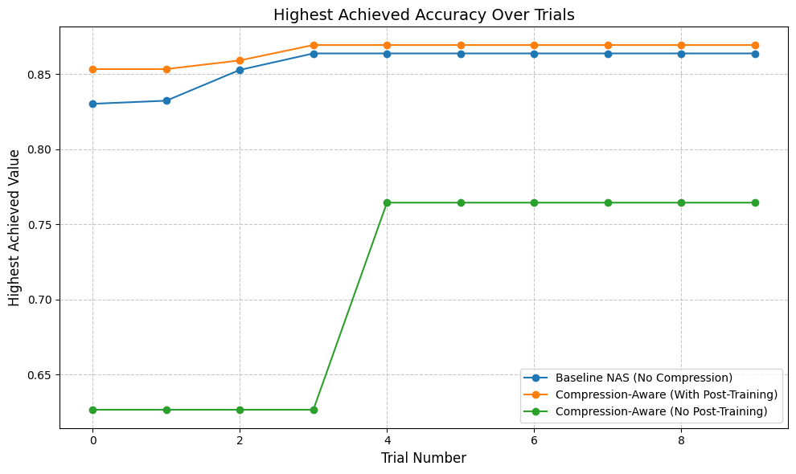

---

## Lab 3

### Implementation Tasks

**In Tutorial 6, all layers allocated to `IntegerLinear` are allocated the same width and fractional width. This is suboptimal, as different layers may have different sensitivities to quantization.**

a. **Modify the code to allow different layers to have widths in the range [8, 16, 32] and fractional widths in the range [2, 4, 8]. Expose this choice as an additional hyperparameter for the Optuna sampler.**

b. **Run the search again, and plot a figure that has the number of trials on the x-axis, and the maximum achieved accuracy up to that point on the y-axis.**

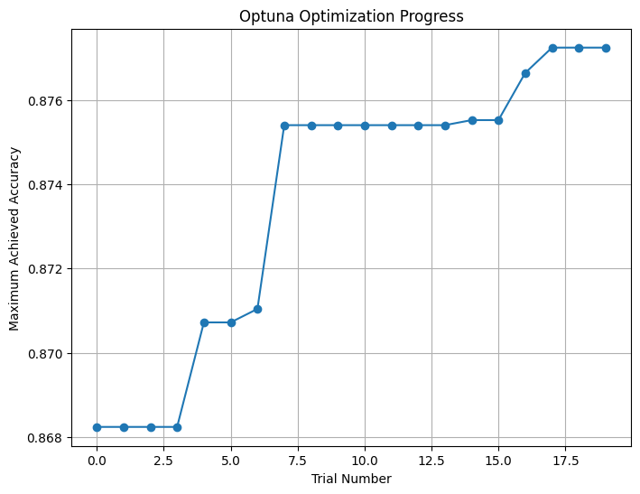

Below is the precison configuariaton for the two best performing trials

| Architecture (Trial) | Accuracy | Precision Config                                                                                                                                                                                                                                                                                                                                                                                                                                                                                                                                                                                                                                           |
| -------------------- | -------- | ---------------------------------------------------------------------------------------------------------------------------------------------------------------------------------------------------------------------------------------------------------------------------------------------------------------------------------------------------------------------------------------------------------------------------------------------------------------------------------------------------------------------------------------------------------------------------------------------------------------------------------------------------------- |
| **Trial 17**   | 0.87724  | `{'bert.encoder.layer.0.attention.output.dense': {'quantizer': 'LinearInteger', 'config': {'data_in_width': 16, 'data_in_frac_width': 2, 'weight_width': 32, 'weight_frac_width': 8, 'bias_width': 32, 'bias_frac_width': 4}}, 'bert.encoder.layer.0.intermediate.dense': {'quantizer': 'LinearInteger', 'config': {'data_in_width': 8, 'data_in_frac_width': 2, 'weight_width': 8, 'weight_frac_width': 4, 'bias_width': 16, 'bias_frac_width': 8}}, ... , 'classifier': {'quantizer': 'LinearInteger', 'config': {'data_in_width': 16, 'data_in_frac_width': 8, 'weight_width': 32, 'weight_frac_width': 4, 'bias_width': 16, 'bias_frac_width': 8}}}` |
| **Trial 16**   | 0.87664  | `{'bert.encoder.layer.0.attention.output.dense': {'quantizer': 'LinearInteger', 'config': {'data_in_width': 32, 'data_in_frac_width': 2, 'weight_width': 32, 'weight_frac_width': 8, 'bias_width': 32, 'bias_frac_width': 4}}, 'bert.encoder.layer.0.intermediate.dense': {'quantizer': 'LinearInteger', 'config': {'data_in_width': 8, 'data_in_frac_width': 2, 'weight_width': 8, 'weight_frac_width': 4, 'bias_width': 16, 'bias_frac_width': 2}}, ... , 'classifier': {'quantizer': 'LinearInteger', 'config': {'data_in_width': 16, 'data_in_frac_width': 2, 'weight_width': 32, 'weight_frac_width': 4, 'bias_width': 16, 'bias_frac_width': 8}}}` |

**In Section 1 of Tutorial 6, when defining the search space, a number of layers are imported, however only `LinearInteger` and the full precision `nn.Linear` are selected.**

a. **Now, extend the search to consider all supported precisions for the Linear layer in Mase, including Minifloat, BlockFP, BlockLog, Binary, etc. This may also require changing the model constructor so the required arguments are passed when instantiating each layer.**

* **`nn.Linear`** : Standard full-precision linear transformation layer.
* **`LinearInteger`** : Linear layer with integer quantization for weights and activations.
* **`LinearMinifloatDenorm`** : Linear layer using a minifloat format that handles denormal numbers. A ****denormal number** (aka subnormal number** ) is a special type of floating-point number that is **very close to zero.**
* **`LinearMinifloatIEEE`** : Linear layer employing IEEE-standard minifloat quantization.
* **`LinearLog`** : Linear layer that applies logarithmic quantization to represent values.
* **`LinearBlockFP`** : Linear layer with block floating-point quantization across groups of parameters.
* **`LinearBlockMinifloat`** : Linear layer that quantizes in blocks using a minifloat format.
* **`LinearBlockLog`** : Linear layer that applies block-wise logarithmic quantization.
* **`LinearBinary`** : Binary quantized linear layer where weights and activations are binarized.

b. **Run the search again, and plot a figure that has the number of trials on the x-axis, and the maximum achieved accuracy up to that point on the y-axis. Plot one curve for each precision to compare their performance.**

For this task I complted a few experimetns. The first was to convert all layers to the selected precision type and allow tht TPE sampler to vary the quantization widths, to see the best perfomance the model could gain. Then I ran an experiment where the model selectively chagned the nn.linear layers to become quantized aswell as being able to vary the widths and fractional widths. Then finally I ran an experiment than intoduced a chop.pass that calculated the avergae number of bits in the model and added that to the objective fucniton to try and find an optimised model that balcaned quantization and performance. This was done for Linear Integer.

### Experiment 1: Full-Layer Quantization

 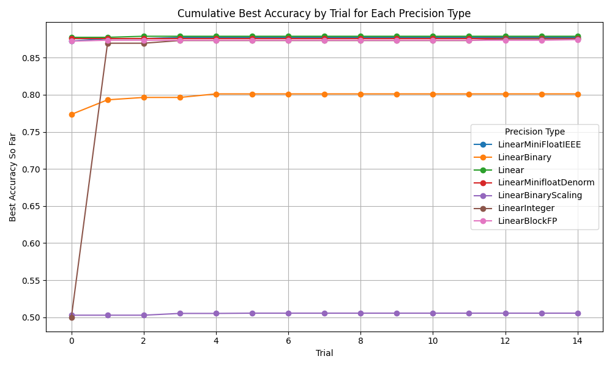

### Experiment 2: Selective Quantization for nn.Linear Layers

 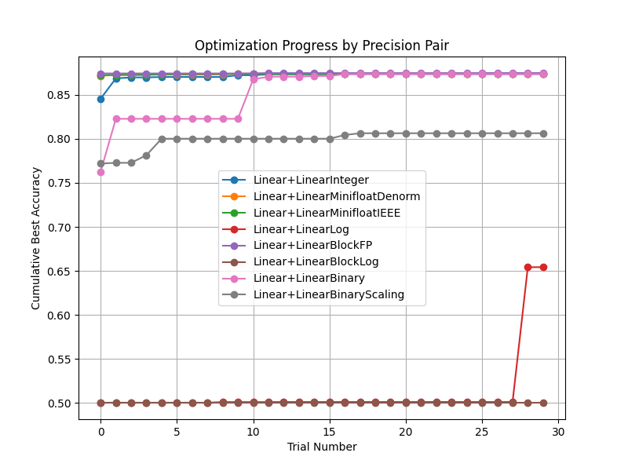

### Experiment 3: Cost-Added Optimization for Balanced Performance

```python
# Build graph from model
graph = build_graph_from_model(model)

# Run average bits analysis pass
graph, avg_bit_dict = calculate_avg_bits_mg_analysis_pass(graph, pass_args={})

# Set alpha to 0.00832:
# This value is determined based on the average accuracy observed,
# as well as the range of average bit widths (from the maximum average bits seen
# to the minimum possible bits), to balance accuracy and quantization cost.
alpha = 0.00832

# Compute composite metric: evaluation accuracy minus cost penalty based on average bit usage
composite_metric = eval_results["eval_accuracy"] - alpha * (avg_bit_dict['w_avg_bit'] + avg_bit_dict['data_avg_bit'])

print("Composite metric:", composite_metric)
```

 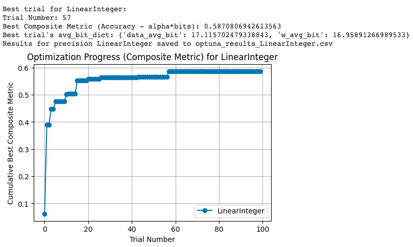
 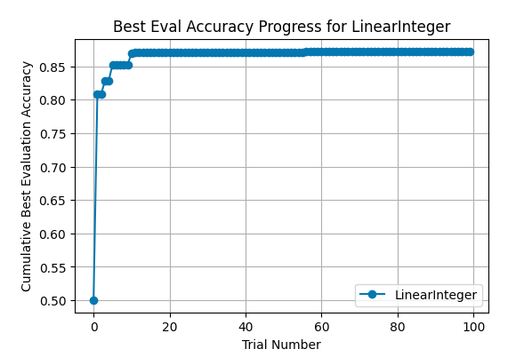

---

## Lab 4

### Implementation Tasks

1. **In the first part of Lab 4 (`torch.compile`), we did not really observe real run-time speedups with `torch.compile`.**

   a. **Modify the code and investigate why this is the case?**

   **Answer:**

   ```python
      device = "cpu"
      n = 100  # Increased number of runs to amortize compilation overhead
   ```

   - The initial iterations include significant compilation and warm-up overhead that is not amortized over only a few runs.
   - Increasing the number of iterations and separating warm-up runs from timed runs proviced a more accurate measure of steady-state performance.

   b. **If you change the `device` to `cuda`, do you observe the same thing?**

   **Answer:**

   - On CUDA, after the initial warm-up, `torch.compile` tends to show more noticeable speedups because GPU kernels benefit from optimizations like operator fusion and kernel fusion. Additionally the test tensor was moved to the the gpu.
   - However, the exact benefit still depends on the model and batch size, but generally, the optimized model performs better on CUDA compared to CPU.
2. **In the second part of Lab 4 (kernel fusion), we looked at a fused SDPA kernel.**

   a. **Now, extend the profiling to the SDPA kernel, compare its runtime behavior with the naive implementation.**

   To extend the porfiling for the SDPA kernel, I then ran for 100 iteraitons and used the new time_sdpa funciton to record averadge time per iteration.

   Naive SDPA average time: 0.881496 seconds per iteration (CPU)
   Fused SDPA average time: 0.031410 seconds per iteration (CPU)

   b. **If you change the `device` to `cuda`, do you observe the same thing?**

   ```python
   # Set device to CUDA
   device = "cuda"
   ```

   As cuda was significatnly faster I ran 100 warm up iterations followed by 10000 iterations.

   CUDA vs. CPU: CUDA demonstrates superior performance because it exploits extensive parallelism, specialized tensor cores, and higher memory bandwidth, attributes that are particularly advantageous for deep learning workloads.

   Fused vs. Naive SDPA: The fused SDPA implementation achieves faster execution by consolidating multiple operations into a single kernel, which minimizes redundant memory transfers and reduces kernel launch overhead.

   Naive SDPA average time: 0.000409 seconds per iteration (GPU)
   Fused SDPA average time: 0.000138 seconds per iteration (GPU)

   ```python

      # New timing function for SDPA functions
      def time_sdpa(fn, query, key, value, n=1000, device="cpu"):
         times = []
         for _ in range(n):
            if device == "cpu":
                  # Ensure the inputs are on CPU for the timing call
                  _, t = timed_cpu(lambda: fn(query.cpu(), key.cpu(), value.cpu()))
            else:
                  _, t = timed_gpu(lambda: fn(query, key, value))
            times.append(t)
         avg_time = sum(times) / len(times)
         return avg_time


      # Choose the device: use "cuda" for GPU testing or "cpu" for CPU testing.
      device = "cuda"  # change to "cpu" if needed

      # Generate random input tensors. These sizes are typical for a Transformer:
      query = torch.randn(32, 8, 128, 64, dtype=torch.float16, device=device)
      key   = torch.randn(32, 8, 128, 64, dtype=torch.float16, device=device)
      value = torch.randn(32, 8, 128, 64, dtype=torch.float16, device=device)

      # Instantiate the SDPA modules and move them to the chosen device.
      naive_sdpa = ScaledDotProductAttention().to(device)
      fused_sdpa = ScaledDotProductAttentionFused().to(device)

      # Warm-up phase: run several iterations to ensure any one-time setup (e.g. kernel compilation)
      # does not affect timing.
      n_warmup = 50
      for _ in range(n_warmup):
         _ = naive_sdpa(query, key, value)
         _ = fused_sdpa(query, key, value)

      # Profile the two implementations.
      n_iterations = 10000  # Increasing reuslts in more stable measurements
      naive_time = time_sdpa(naive_sdpa, query, key, value, n=n_iterations, device=device)
      fused_time = time_sdpa(fused_sdpa, query, key, value, n=n_iterations, device=device)

      print(f"Naive SDPA average time: {naive_time:.6f} seconds per iteration")
      print(f"Fused SDPA average time: {fused_time:.6f} seconds per iteration")

   ```
3. **In the third part of Lab 4 (Custom kernel), we go through how to write MXINT8 dequantization kernel and bind it to Python.**

   a. **How does MXINT8 benefit custom hardware if both the activation and weights in a linear layer are quantized to MXINT8?**

   When you represent both weights and activations in 8 bits, each number takes up much less space than a typical 32‑bit float.

   * **Less Data to Move:** Fewer bits mean you can load and store more numbers at once, reducing memory bandwidth pressure.
   * **More Parallelism:** Specialized hardware (like tensor cores) is optimized to perform many 8‑bit operations at once, so more calculations can happen in parallel.
   * **Efficient Multiply-Accumulate:** With both weights and activations as 8‑bit mantissas and a single shared exponent per group, multiplications are performed directly using uniform 8‑bit units, and the exponent adjustment is applied just once per group, simplifying computation and reducing energy consumption.

   b. **What is the purpose of the variables `dont_need_abs` and `bias` in the C++ for loop?**

   ```python
   auto dont_need_abs = bool(mantissa_abs & 0x40);
   ```

   The code checks if bit 6 (0x40), is 1 or 0. This bit 6 is called the flag bit.

   * **If the flag (bit 6) is set (i.e., 1):**
     The number is considered “high-range” and it is as if it were normalized (similar to having an implicit 1 in IEEE 754). No extra bias correction is needed.
   * **If the flag is not set (i.e., 0):**
     The number is in the “low range” (like a subnormal number) and lacks that implicit high-order bit. Therefore, a bias correction is applied during dequantization to adjust its value.

   ```python
   auto bias = cutlass::bfloat16_t::bitcast(sign | exp | uint16_t(0));
   ```

   **`bias`** represents the implicit leading 1 for normalized numbers. It’s computed using the sign and exponent bits, with the mantissa set to zero (`uint16_t(0)`), effectively representing **1.0 scaled by the exponent** . This bias is subtracted when  `dont_need_abs` is false to correct low-range values.

   Bias is subtracted when dont_need_abs is false (i.e., when the mantissa’s top bit is not set).

   ```python
   y[i] = dont_need_abs ? out : out - bias;
   ```

   This subtraction compensates for the missing leading 1, effectively reducing the exponent by 1 in bfloat16 terms, ensuring the correct reconstruction of the original value.

   c. **How does `cta_tiler` partition data for copying to shared memory in CUDA kernel? How does `layout_sX` partition threads in a threadblock for computation? (Challenge)

   #### The  `cta_tiler`:


   - **Purpose:** Splits the global 1D data (conceptually reshaped as a 2D matrix of size `[num_groups, group_size]`) into fixed-size tiles.
   - **Mechanism:**
   - Uses the CTA’s coordinates (`blockIdx.x` and `blockIdx.y`) to select a submatrix (tile) of shape `(BLK_M, BLK_K)`.
   - **Example:**
     Suppose the global data is reshaped into a 4×4 matrix:

     global data:

     ```
     [ a,  b,  c,  d, e,  f,  g,  h, i,  j,  k,  l, m,  n,  o,  p ] 
     ```

     reshaped (each row is a group )

     ```
     [ [ a,  b,  c,  d ],
        [ e,  f,  g,  h ],
        [ i,  j,  k,  l ],
        [ m,  n,  o,  p ] ]
     ```

     A CTA with a tile shape of (2,2) might extract the top-left tile:

     ```
     [ [ a,  b ],
        [ e,  f ] ]
     ```

     This tile is copied from global memory to shared memory.

   #### `layout_sX`: Thread-Level Work Partitioning

   - **Purpose:** Divides the shared memory tile among the threads within a CTA for parallel computation.
   - **Mechanism:**
   - Maps the shared memory tile (of shape `(BLK_M, BLK_K)`) into smaller pieces assigned to each thread.
   - **Example:**
     Given the shared tile from before:

     ```
     [ [ a,  b ],
        [ e,  f ] ]
     ```

     And a thread block with 4 threads, a simple mapping could be:

     | Thread | Element |
     | ------ | ------- |
     | T0     | a       |
     | T1     | b       |
     | T2     | e       |
     | T3     | f       |

     Each thread then processes its assigned element.

   ---

   **Summary:**
   `cta_tiler` partitions the global data into CTA-sized tiles (e.g., extracting a 2×2 submatrix) for efficient copying into shared memory. Then, `layout_sX` subdivides this tile among the threads in the thread block (e.g., assigning one element per thread) to enable balanced, parallel computation.

   d. **Why is the saved GPU memory not exactly (32 - (4+8/32))/32 = 86.7% of the FP32 model?**

   **Answer:

   The above calculation assumes converting FP32 weights to MXINT4, however the code uses MXINT8 giving a theoretical weight storage reduction of about 74.2%:

   (32 - (8+8/32))/32 = 74.2%

   This means that if every weight were quantized, you’d expect a 74.2% reduction for those weights. However, the overall GPU memory 	saving is lower (around 66.4% in the example) due to:

   1. **Selective Quantization:**
      The code only quantizes linear layers (excluding classifier layers). Other components (like activations, layer norms, and embeddings) remain in full precision, limiting total savings.

      ```python
      for layer_name, layer in model.named_modules():
         if not isinstance(layer, torch.nn.Linear):
            continue
         if "classifier" in layer_name:
            continue
         layer.cuda()
         layer_q = QLinearPacked.build_from_linear(layer, group_size=mxint8_group_size)
         set_layer_by_name(model, layer_name, layer_q)
         del layer
         torch.cuda.empty_cache()

      ```
   2. **Additional Overheads**
      GPU memory also holds activations, temporary buffers, and metadata, which are not reduced by weight quantization, further lowering the overall memory savings.

---
